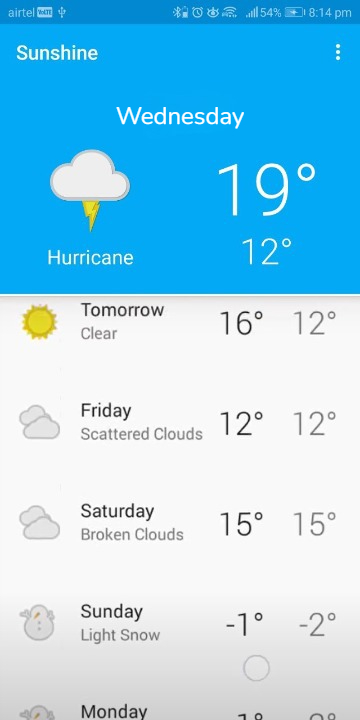
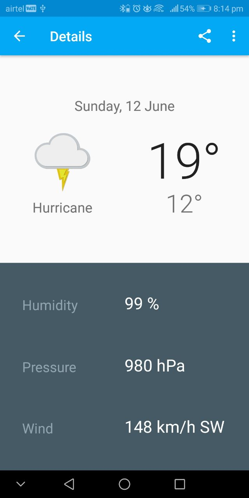
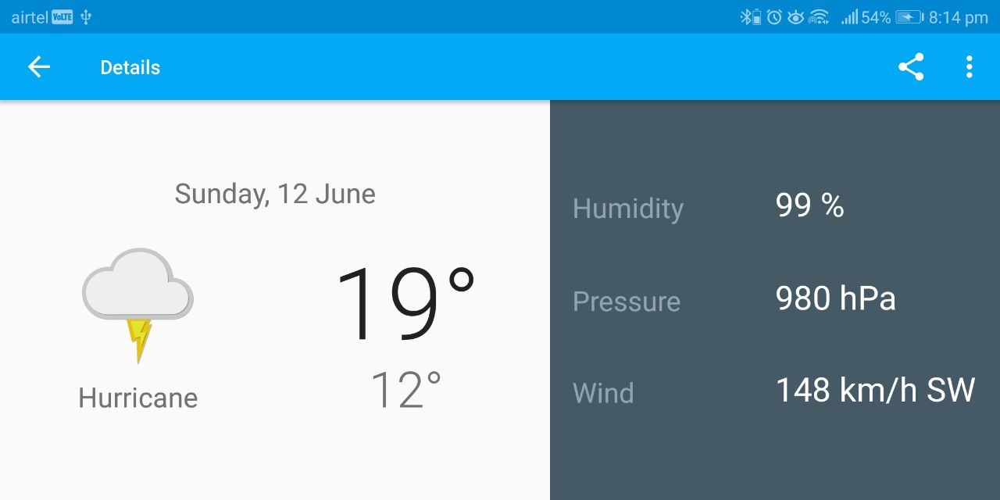
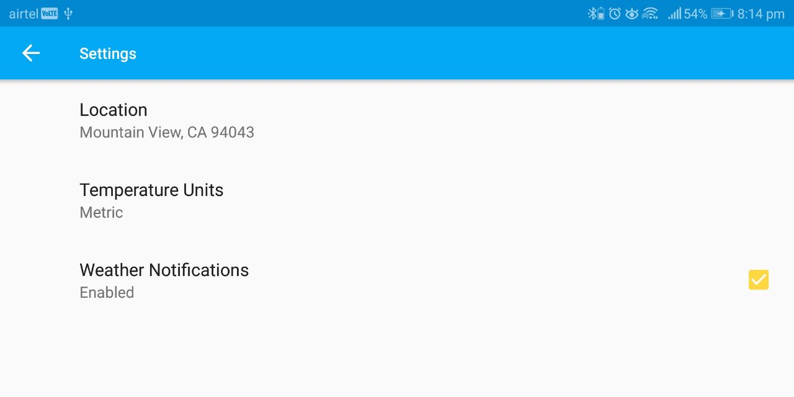

# Sunshine-Weather-App
It is a realtime location based weather app made using openweather api, Java and Android Studio.

# How to implement?

1. Clone the repo or download the source code on your local machine.

# Screenshots

## MainScreen

  

## Detail Screen 

    

## Settings screen

